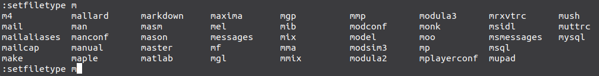

[//]: # (-----------------------------------------------------------------)

[//]: # (Projet Kiweed - Article :  
			Corrections et Abréviations en fonction du type de fichier
			Organiser .vim en fonction des filetypes
		)

[//]: # (Auteur : georges)

[//]: # (Date : lun. 19 mars 2018 à 05:51:28)

[//]: # (-----------------------------------------------------------------)

Statut : **EN_COURS** | Complexité : basique | Temps : 1h | Mars 2018 |
Georges AKA Kiweed | Tested on Debian U

### Balade : plugins et types de fichiers</code>

#### <a name="sommaire">**Sommaire**</a>

##### &nbsp;&nbsp;&nbsp;[Objectifs](#objectifs)
##### &nbsp;&nbsp;&nbsp;[Contexte](#preambule)
##### &nbsp;&nbsp;&nbsp;[Exécution des scripts par défaut](#fctmnt)
 &nbsp;&nbsp;&nbsp;&nbsp;&nbsp;&nbsp;&nbsp;[Arbrescence de <code>vim</code>](#orga)

 &nbsp;&nbsp;&nbsp;&nbsp;&nbsp;&nbsp;&nbsp;[Progression pour bien comprendre](#progression)

##### &nbsp;&nbsp;&nbsp;[<code>~/.vimrc</code> et <code>.vim</code>](#ptvim)
 &nbsp;&nbsp;&nbsp;&nbsp;&nbsp;&nbsp;&nbsp;[Désactiver un plugin par défaut : <code>~/.vimrc</code>](#delplug)

 &nbsp;&nbsp;&nbsp;&nbsp;&nbsp;&nbsp;&nbsp;[Adapter le lancement : <code>~/.vim</code>](#myplug)

##### &nbsp;&nbsp;&nbsp;[*FileType* et plugins : <code>~/.vim/ftplugin</code>](#ftplugin)
 &nbsp;&nbsp;&nbsp;&nbsp;&nbsp;&nbsp;&nbsp;[Lister les *filetypes* déclarés](#lsft)
##### &nbsp;&nbsp;&nbsp;[La minute HHGTTG : plonger dans les *inky depths*](#hhgttg)

---

### <a name="objectifs">Objectifs</a>

- [x] Comprendre et organiser le répertoire <code>&#126;/.vim</code> 

- [x] Comprendre les <code>filetype</code>

- [x] Créer son propre <code>filetype</code>

- [x] Préparer la création d'abréviations dédiées (<code>.java</code>,
  <code>c</code>, <code>.md</code>, etc.)

##### Ce qu'on y apprend au passage...

- [x] Différencier les trois répertoire <code>after</code>, <code>ftplugin</code>, 
<code>plugin</code>, <code>syntax</code>

- [x] Lister dans l'ordre les scripts exécuter lors du démarrage de
  <code>vim</code>

- [x] Garder un <code>&#126;/.vimrc</code> propre

- [x] Afficher l'ensemble des <code>filetype</code> reconnus par vim

 

[(**sommaire ^**)](#sommaire)

 

## <a name="preambule">Contexte</a>

Nous allons définir des actions, des abréviations (ou autre), en fonction du
type de fichier (son extension).

Si on travaille avec un fichier <code>.java</code>, le fichier spécifique
contenant les abréviations pour <code>.java</code> sera exécuté. 

Pareil pour les
<code>.c</code>, <code>.md</code> (markdown), <code>.txt</code>, <code>.tex</code> (LaTex), etc.

Parfois... Ça semble ne pas fonctionner... D'où l'intérêt de cet article.
:wink:

 

De la même façon, corrections, auto-corrections, abréviations, <code>map</code>, etc. 
sont liées au type de fichier, c'est-à-dire son extension pour <code>vi</code>.

Suivant le contexte, développement ou rédaction d'article par exemple, la
correction n'interviendra pas forcément sur les mêmes régions :

- sur l'ensemble du fichier, s'il s'agit d'un article en <code>.txt</code>

- __seulement__ sur les commentaires s'il s'agit d'un source <code>.c</code> ou
  autre.

Il en est de même pour les abréviations :

- celles pour présenter un entête C, Java ou autre

- celles qui font office de raccourcis pour déclarer des fonctions ou des
  classes.

- ou encore les abréviations d'auto-correction pour les fichiers <code>.txt</code>, voire d'autres.

 

[(**sommaire ^**)](#sommaire)

 

## <a name="fctmnt">L'exécution des scripts par défaut</a>

 

Nous l'avons déjà vu ([Démarrage de <code>vi</code>](https://github.com/Kiweedoo/kiweed/blob/master/Promenades_Terrestres/Travailler_avec_VI/20_vi_dicos_correction_ortho.md#launch)), il se passe des choses.

Si l'on s'en tient uniquement aux scripts (<code>~/.vimrc</code> en est un)...

:trident: <code>script</code> :  sont des fichiers de commandes <code>vi</code> 
qui sont lus et exécutés au lancement... Exactement comme si on exécutait, 
pas à pas, à la main, en ligne de commande <code>vi</code> (par la 
commande <code>:</code>) chacune des instructions.

La commande interne à <code>vi</code>, <code>scriptname</code> permet de lister
l'ordre de lecture et d'exécution des fichiers.

><pre>
> <b>:scriptname</b>
> 1: /usr/share/vim/vimrc
> 2: /usr/share/vim/vim80/debian.vim
> 3: /usr/share/vim/vim80/syntax/syntax.vim
> 4: /usr/share/vim/vim80/syntax/synload.vim
> 5: /usr/share/vim/vim80/syntax/syncolor.vim
> 6: /usr/share/vim/vim80/filetype.vim
> <b>7: ~/.vimrc</b>
> 8: /usr/share/vim/vim80/ftplugin.vim
> 9: /usr/share/vim/vim80/indent.vim
> [...] 
> 17: /usr/share/vim/vim80/plugin/spellfile.vim
> [...] 
> <b>22: /usr/share/vim/vim80/syntax/markdown.vim</b>
> 23: /usr/share/vim/vim80/syntax/html.vim
> [...] 
> 26: /usr/share/vim/vim80/syntax/css.vim
> <b>27: ~/.vim/ftplugin/markdown.vim</b>
> 28: /usr/share/vim/vim80/ftplugin/markdown.vim
> 29: /usr/share/vim/vim80/ftplugin/html.vim
> [...] 
> 31: ~/.vim/after/ftplugin/markdown/instant-markdown.vim
></pre>

(le résultat diffère suivant l'extension du fichier...)

 

<code>&#126;/.vimrc</code> est lu est exécuté **avant** d'autres scripts système...

Si ces scripts contiennent une des commandes <code>&#126;/.vimrc</code>, cette
dernière sera écrasée... Sauf si on prend prend les précautions qui s'imposent.

 

### <a name="orga">Arborescence de <code>&#126;/.vim</code></a>

 

:trident: <code>~/.vim</code> contient les répertoires dont les contenus
vont compléter, ou remplacer, les actions exécutées par défaut (celles des
scripts système lus avant).

À ma connaissance, il y en a cinq (probablement d'autres) :

- <code><b>&#126;/.vim/after</b></code> : pour tout ce qui est fait après, en dernier. C'est
  celui que nous utiliserons pour le *previewer* markdown.

- <code><b>&#126;/.vim/ftplugin</b></code> : les actions (commandes) à exécuter **en fonction** du
  *filetype* (déterminer par l'extension).

- <code><b>&#126;/.vim/plugin</b></code> : celles qui s'appliquent à tous les fichiers quelle qu'en
  soit l'extension.

- <code><b>&#126;/.vim/syntax</b></code> : les fichiers spécifiques de syntaxes... Un exemple plus
  bas.

- <code><b>&#126;/.vim/ftdetect</b></code> : pour définir notre propre type de fichier, d'extension
  particulière... Exemple ci-dessous.

:bell::pencil:

:trident: Ces répertoires sont lus **avant** les scripts système correspondant. Leur
contenu peut éventuellement être écrasé.

 

### <a name="progression">Progression pour bien comprendre</a>

 

Au départ, j'ai les répertoires suivant sous <code>&#126;/.vim</code>

><pre>
> drwxrwxr-x 3 georges georges 4096 2018-03-10-17:10 after
> drwxrwxr-x 2 georges georges 4096 2018-03-21-10:38 ftdetect
> drwxrwxr-x 2 georges georges 4096 2018-03-20-18:23 ftplugin
> drwxrwxr-x 2 georges georges 4096 2018-03-18-19:46 plugin
> drwxr-xr-x 2 georges georges 4096 2018-03-18-09:11 spell
> drwxrwxr-x 2 georges georges 4096 2018-03-20-13:22 syntax
></pre>

On se crée un petit répertoire de tests, et on s'y place :

><pre>
> mkdir vim_tests
> cd vim_tests
></pre>

On crée un fichier bidon, pour lancer la commande <code>:scriptname</code>, en
lui donnant l'extension <code>.md</code> (markdown) puisque c'est mon activité
du moment :

><pre>
> vi prout.md
> <b>:scriptname</b>

></pre>

:trident: Bien entendu le résultat est différent si on donne une autre extension
connue...

><pre>
> 1: /usr/share/vim/vimrc
> 2: /usr/share/vim/vim80/debian.vim
> 3: /usr/share/vim/vim80/syntax/syntax.vim
> 4: /usr/share/vim/vim80/syntax/synload.vim
> 5: /usr/share/vim/vim80/syntax/syncolor.vim
> 6: /usr/share/vim/vim80/filetype.vim
> <b>7: ~/.vim/ftdetect/pad.vim</b>
> <b>8: ~/.vimrc</b>
> 9: /usr/share/vim/vim80/ftplugin.vim
> 10: /usr/share/vim/vim80/indent.vim
> 11: /usr/share/vim/vim80/plugin/getscriptPlugin.vim
> 12: /usr/share/vim/vim80/plugin/gzip.vim
> 13: /usr/share/vim/vim80/plugin/logiPat.vim
> 14: /usr/share/vim/vim80/plugin/manpager.vim
> 15: /usr/share/vim/vim80/plugin/matchparen.vim
> 16: /usr/share/vim/vim80/plugin/netrwPlugin.vim
> 17: /usr/share/vim/vim80/plugin/rrhelper.vim
> 18: /usr/share/vim/vim80/plugin/spellfile.vim
> 19: /usr/share/vim/vim80/plugin/tarPlugin.vim
> 20: /usr/share/vim/vim80/plugin/tohtml.vim
> 21: /usr/share/vim/vim80/plugin/vimballPlugin.vim
> 22: /usr/share/vim/vim80/plugin/zipPlugin.vim
> 23: /usr/share/vim/vim80/syntax/markdown.vim
> 24: /usr/share/vim/vim80/syntax/html.vim
> 25: /usr/share/vim/vim80/syntax/javascript.vim
> 26: /usr/share/vim/vim80/syntax/vb.vim
> 27: /usr/share/vim/vim80/syntax/css.vim
> <b>28: ~/.vim/ftplugin/markdown.vim</b>
> <b>29: /usr/share/vim/vim80/ftplugin/markdown.vim</b>
> 30: /usr/share/vim/vim80/ftplugin/html.vim
> 31: /usr/share/vim/vim80/autoload/htmlcomplete.vim
> <b>32: ~/.vim/after/ftplugin/markdown/instant-markdown.vim</b>
> ></pre>

Bien... On voit qu'il fait __beaucoup__ de choses... 

Purgeons !

Revenons à une situation dans laquelle nous n'avons, ni <code>&#126;/.vimrc</code>,
ni <code>&#126;/.vim</code> (car même sans
<code>&#126;/.vimrc</code>, le _par défaut_ gère la détection des types de fichiers)

><pre>
> mv ~/.vimrc ~/.vimrc.ORI
> mv ~/.vim ~/.vim.ORI
></pre>

Maintenant que nous n'avons ni <code>&#126;/.vimrc</code>, ni répertoire <code>&#126;/.vim</code>,
relançons avec un fichier sans extension : 

><pre>
> vi prout
> <b>:scriptname</b>
> 1: /usr/share/vim/vimrc
> 2: /usr/share/vim/vim80/debian.vim
> 3: /usr/share/vim/vim80/syntax/syntax.vim
> 4: /usr/share/vim/vim80/syntax/synload.vim
> 5: /usr/share/vim/vim80/syntax/syncolor.vim
> 6: /usr/share/vim/vim80/filetype.vim
> 7: /usr/share/vim/vim80/defaults.vim
> 8: /usr/share/vim/vim80/syntax/nosyntax.vim
> 9: /usr/share/vim/vim80/ftplugin.vim
> 10: /usr/share/vim/vim80/indent.vim
> 11: /usr/share/vim/vim80/plugin/getscriptPlugin.vim
> 12: /usr/share/vim/vim80/plugin/gzip.vim
> 13: /usr/share/vim/vim80/plugin/logiPat.vim
> 14: /usr/share/vim/vim80/plugin/manpager.vim
> 15: <b>/usr/share/vim/vim80/plugin/matchparen.vim</b>
> 16: /usr/share/vim/vim80/plugin/netrwPlugin.vim
> 17: /usr/share/vim/vim80/plugin/rrhelper.vim
> 18: /usr/share/vim/vim80/plugin/spellfile.vim
> 19: /usr/share/vim/vim80/plugin/tarPlugin.vim
> 20: /usr/share/vim/vim80/plugin/tohtml.vim
> 21: /usr/share/vim/vim80/plugin/vimballPlugin.vim
> 22: /usr/share/vim/vim80/plugin/zipPlugin.vim
> 23: /usr/share/vim/vim80/scripts.vim
></pre>

 

Même idée avec un <code>prout.md</code>

><pre>
> vi prout.md
> <b>:scriptname</b>
> 1: /usr/share/vim/vimrc
> 2: /usr/share/vim/vim80/debian.vim
> 3: /usr/share/vim/vim80/syntax/syntax.vim
> 4: /usr/share/vim/vim80/syntax/synload.vim
> 5: /usr/share/vim/vim80/syntax/syncolor.vim
> 6: /usr/share/vim/vim80/filetype.vim
> 7: /usr/share/vim/vim80/defaults.vim
> 8: /usr/share/vim/vim80/syntax/nosyntax.vim
> 9: /usr/share/vim/vim80/ftplugin.vim
> 10: /usr/share/vim/vim80/indent.vim
> 11: /usr/share/vim/vim80/plugin/getscriptPlugin.vim
> 12: /usr/share/vim/vim80/plugin/gzip.vim
> 13: /usr/share/vim/vim80/plugin/logiPat.vim
> 14: /usr/share/vim/vim80/plugin/manpager.vim
> 15: <b>/usr/share/vim/vim80/plugin/matchparen.vim</b>
> 16: /usr/share/vim/vim80/plugin/netrwPlugin.vim
> 17: /usr/share/vim/vim80/plugin/rrhelper.vim
> 18: /usr/share/vim/vim80/plugin/spellfile.vim
> 19: /usr/share/vim/vim80/plugin/tarPlugin.vim
> 20: /usr/share/vim/vim80/plugin/tohtml.vim
> 21: /usr/share/vim/vim80/plugin/vimballPlugin.vim
> 22: /usr/share/vim/vim80/plugin/zipPlugin.vim
> 23: /usr/share/vim/vim80/syntax/markdown.vim
> 24: /usr/share/vim/vim80/syntax/html.vim
> 25: /usr/share/vim/vim80/syntax/javascript.vim
> 26: /usr/share/vim/vim80/syntax/vb.vim
> 27: /usr/share/vim/vim80/syntax/css.vim
> 28: /usr/share/vim/vim80/ftplugin/markdown.vim
> 29: /usr/share/vim/vim80/ftplugin/html.vim
> 30: /usr/share/vim/vim80/autoload/htmlcomplete.vim
></pre>

Voilà donc la liste de tous les scripts exécutés par défaut lors du
lancement d'une session **pour un fichier <code>.md</code>**

:bell::pencil:

:trident: on se rappelera que le résultat diffère suivant l'extension
puisque certains scripts sont exécutés par défaut.

[(**sommaire ^**)](#sommaire)

 

## <a name="ptvim"><code>~/.vimrc</code> et <code>&#126;/.vim</code></a>

 

Les deux sont intimement liés.

La lecture du <code>&#126;/.vimrc</code> **avant** les plugins par défaut, et donc
**avant** l'exécution des contenus de <code>~/.vim</code>, **permet de gérer les
plugins chargés par défaut**.

 

### <a name="delplug"><code>~/.vimrc</code> : déscativer un plugin par défaut</a>

 

Prenons par exemple le cas de <code>matchparen.vim</code> qui permet d'avoir une
coloration syntaxique sur l'appariement des parenthèses, des accolades, et des crochets...

Très bien... Sauf que la couleur d'appariement dépend de la coloration
syntaxique suivant le type de fichiers <code>.c</code>, <code>.txt</code>, etc.

Et bien sûr, suivant les cas, je ne vois plus mon curseur et ne sais donc pas
s'il est sur la parenthèse ouvrante, ou celle fermante... :angry:

Résultat... Invalidation du plugin et vérification des appariements à 
l'ancienne : en mode commande avec <code>%</code> quand placé sur l'une ou l'autre.

 

L'unique façon propre d'empêcher le chargement d'un plugin est de le dire dans le
<code>&#126;/.vimrc</code>.

Regardons d'abord par quoi  commencent **tous** les plugins par défaut :

><pre>
> head -12 <b>/usr/share/vim/vim80/plugin/matchparen.vim</b>
></pre>

<code>head</code>, sans option, pour afficher 10 lignes d'un
fichier **à partir du début** ; <code>tail</code>, idem, **à partir de la fin**.
Si <code>-12</code>, les 12 premières lignes, etc.

Le résulat est :

><pre>
> " Vim plugin for showing matching parens
> " Maintainer:  Bram Moolenaar <Bram@vim.org>
> " Last Change: 2016 Feb 16
> 
> " Exit quickly when:
> " - this plugin was already loaded (or disabled)
> " - when 'compatible' is set
> " - the "CursorMoved" autocmd event is not available.
> <b>if exists("g:loaded_matchparen")</b> || &cp || !exists("##CursorMoved")
>     finish
> endif
> <b>let g:loaded_matchparen = 1</b>
></pre>

Rien de bien sorcier, si le label global <code>g:loaded_matchparen</code>
existe... Terminé... Sinon, il le positionne.

Tous les plugins commencent de la même manière.

Une fois que l'on connait le label testé, il suffit de le déclarer dans
<code>&#126;/.vimrc</code> avev la commande <code>let</code>

><pre>
> vi &#126;/vimrc
> let loaded_matchparen = 1
> [esc]:x 
></pre>

Et c'est terminé... Examinons néanmoins la finesse... :

><pre>
> vi prout
> :scriptname
> [...]
> <b>&#126;/.vimrc</b>
> [...]
> <b>/usr/share/vim/vim80/plugin/matchparen.vim</b>
> [...]
></pre>

Il est quand même chargé... et exécuté... :flushed:

C'est bien l'exécution du <code>if exists</code> qui permet de s'affranchir de
l'appariement des parenthèses... :smiling_imp:

:bell::pencil:

Même si la coloration syntaxique n'apparait plus, il **est
toujours** possible de vérifier l'appariement, à l'ancienne, mode commande : 

- en se plaçant sur une <code>&#40;</code>, une <code>&#123;</code>, 
ou un <code>&#91;</code>, et en appuyant sur <code><b>%</b></code>

:trident: Remarque : pour l'appariement, il existe une commande interne (<code>:set
showmatch</code> et <code>:set noshowmatch</code>, dont les abréviations sont
<code>:se sm</code> et <code>:se nosm</code>) mais l'objectif était de
généraliser à l'ensemble des plugins.

[(**sommaire ^**)](#sommaire)

 

### <a name="myplug">Adapter le lancement : <code>~/.vim</code></a>

 

Restaurons maintenant le dossier <code>&#126;/.vim</code> :

><pre>
> mv &#126;/.vim.ORI &#126;/.vim
></pre>

Si on ne fait rien de plus, il n'y aura aucune différence : 

- le <code>&#126;/.vimrc</code> sera lu et exécuté

- les plugins par défaut seront lu et exécutés...

L'arborescence <code>&#126;/.vim</code> contient les scripts de
personnalisation.

Encore faut-il dire dans <code>&#126;/.vimrc</code> qu'on veut les appliquer...

Commençons par le type de fichier (<code>filetype</code>), en aditant <code>&#126;/.vimrc</code> pour
ajouter :

><pre>
> vi &#126;/.vimrc
> let loaded_matchparen = 1
> filetype plugin indent on
></pre>

Pour détecter le type **et** activer l'exécution des contenus de
<code>&#126;/.vim</code> et la gestion de l'indentation qui rend bien des
services, notamment pour le déplacement de blocs... (mais pas nécessaire pour ce
qui suit)

Maintenant, lançons un <code>prout.md</code> (extension markdown) :

><pre>
> vi prout.md
> :scriptname
>
> 1: /usr/share/vim/vimrc
> 2: /usr/share/vim/vim80/debian.vim
> [...]
> 6: /usr/share/vim/vim80/filetype.vim
> 7: ~/.vim/ftdetect/pad.vim
> 8: ~/.vimrc
> 9: /usr/share/vim/vim80/ftplugin.vim
> 22: /usr/share/vim/vim80/syntax/markdown.vim
> [...]
> 27: <b>~/.vim/ftplugin/markdown.vim</b>
> 28: /usr/share/vim/vim80/ftplugin/markdown.vim
> [...]
> 31: <b>~/.vim/after/ftplugin/markdown/instant-markdown.vim</b>
> [...]
></pre>

Il est bien aller chercher ce qui concernait le markdown dans le
<code>&#126;/.vim</code> perso.

 

[(**sommaire ^**)](#sommaire)

 

## <a name="ftplugin">*FileType* et plugins : <code>~/.vim/ftplugin</code></a>

 

Le répertoire <code>&#126;/.vim/ftplugin</code> contient les scripts qui seront exécutés 
**en fonction de l'extension détectée au lancement** de <code>vi</code>.

 

Ci-dessous, ce que contient le mien :

><pre>
> ls &#126;/.vim/ftplugin
> c.vim
> java.vim
> markdown.vim
> sh.vim
> text.vim
> tex.vim
></pre>

 

:bell::pencil:

La syntaxe de nommage de ces fichiers doit **impérativement être** <code><b>filetype.vim</b></code>

Il est donc important de savoir quels sont les *filetypes* reconnus.

 
Lançons une session avec un fichier sans extension et demandons quel est son
*filetype* détecté avec la commande suivante :

><pre>
> vi prout
> <b>:set filetype?</b>
></pre>

Pour obtenir en réponse :

><pre>
> <b>filetype=?</b>
></pre>

Qui signifie que le *filetype* est inconnu.

Avant de regarder quels sont les *filetypes* déclarés, testons avec l'extension
<code>.md</code> et posons la même question&nbsp;:

><pre>
> <b>vi prout.md</b>
> <b>:set filetype?</b>
></pre>

Cette fois la réponse est :

><pre>
> <b>filetype=markdown</b>
></pre>

:bell::pencil:

Si un fichier nommé <code>markdown.vim</code> existe dans
<code>&#126;/.vim/ftplugin</code>, il sera lu et exécuté, dès lors
que <code>vi</code> ouvrira un fichier d'extension <code>.md</code> ; et
uniquement dans ce cas.

 

### <a name="lsft">Lister les *filetypes* déclarés</a>

 

Plusieurs façons de savoir quels sont les *filetypes* reconnus.  Sans trop pénétrer les arcanes de
<code>vi</code>&nbsp;:

- à l'aide de la commande <code>setfiletype</code>, en **un seul mot**
  (différente de celle vue précédemment)

- avec la commande <code>echo</code> et la fonction <code>getcompletion()</code>

La liste s'obtient avec la complétion <code>&lt;space&gt;&lt;ctrl-d&gt;</code>
**immédiatement après** la commande.

 

Pour obtenir la liste des *filetypes* débutant par <code>'m'</code> :

><pre>
> <b>:setfiletype&lt;space&gt;m&lt;ctrl-d&gt;</b>
></pre>

Pour obtenir&nbsp;:

:bell::pencil:

:trident: <code>prout.md</code> <b>est différent de</b> <code>prout.MD</code>

 

[(**sommaire ^**)](#sommaire)

ICI
---

### [La minute HHGTTG : ](#hhgttg)

:metal::alien::+1:
 

[(**sommaire ^**)](#sommaire)

