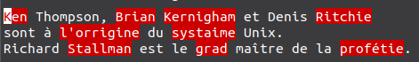
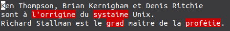
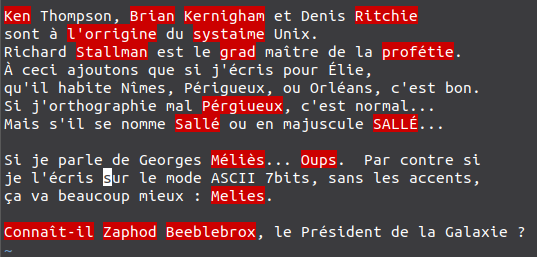
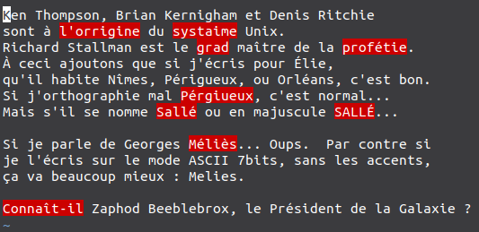
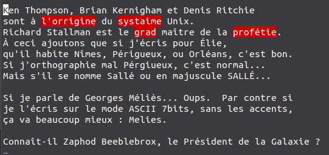
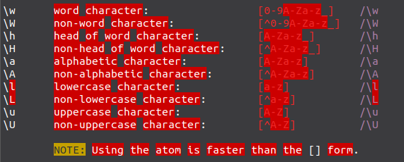
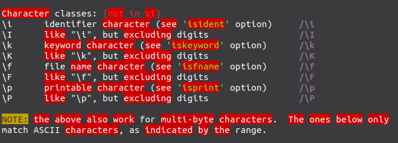
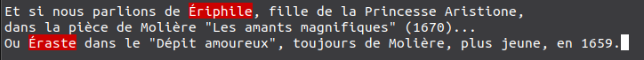
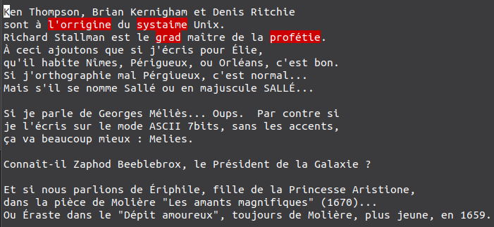
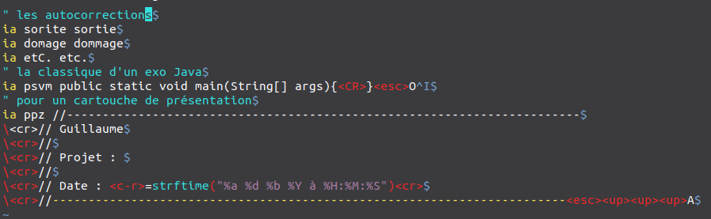

[//]: # (-----------------------------------------------------------------)

[//]: # (Projet Kiweed - Article :  installation et utilisation des langues
					et des autocorrections)

[//]: # (Date : dim. 18 mars 2018 à 20:09:50)

[//]: # (Auteur : )

[//]: # (-----------------------------------------------------------------)

Statut : OK | Complexité : intermédiaire | Temps : 1h30 | Mars 2018 | Georges AKA Kiweed | Tested on Debian U

### Balade : langues et correction orthographique dans `vi`

#### <a name="sommaire">**Sommaire**</a>

##### &nbsp;&nbsp;&nbsp;[Objectifs](#objectifs)
##### &nbsp;&nbsp;&nbsp;[Préambule](#preambule)
 &nbsp;&nbsp;&nbsp;&nbsp;&nbsp;&nbsp;&nbsp;[Les Locales](#varloc)

 &nbsp;&nbsp;&nbsp;&nbsp;&nbsp;&nbsp;&nbsp;[`aspell`et les dictionnaires](#aspell)
##### &nbsp;&nbsp;&nbsp;[Installation des dictionnaires](#installdicos)
##### &nbsp;&nbsp;&nbsp;[Configuration de la langue dans`vi`](#vimrc)
 &nbsp;&nbsp;&nbsp;&nbsp;&nbsp;&nbsp;&nbsp;[Le démarrage de `vi`](#launch)

 &nbsp;&nbsp;&nbsp;&nbsp;&nbsp;&nbsp;&nbsp;[Création du `~/.vimrc` et déclaration de la langue](#crevimrc)

 &nbsp;&nbsp;&nbsp;&nbsp;&nbsp;&nbsp;&nbsp;[Commandes d'utilisation  et macros](#commandes)

 &nbsp;&nbsp;&nbsp;&nbsp;&nbsp;&nbsp;&nbsp;[Ajout des macros de désactivation/activation](#addmacros)

 &nbsp;&nbsp;&nbsp;&nbsp;&nbsp;&nbsp;&nbsp;[Ajout des macros de correction](#addmacroscorrect)
##### &nbsp;&nbsp;&nbsp;[Utilisation de la correction](#playspell)
 &nbsp;&nbsp;&nbsp;&nbsp;&nbsp;&nbsp;&nbsp;[Nommer correctement les fichiers](#namefile)

 &nbsp;&nbsp;&nbsp;&nbsp;&nbsp;&nbsp;&nbsp;[Empêcher la correction sur les noms propres](#propernouns)
##### &nbsp;&nbsp;&nbsp;[Expressions régulières et noms propres](#propers_w_k)
##### &nbsp;&nbsp;&nbsp;[Abréviations et auto-correction](#auto_correct)
##### &nbsp;&nbsp;&nbsp;[La minute HHGTTG : plonger dans les *inky depths*](#hhgttg)

---

### <a name="objectifs">Objectifs</a>

- [x] Approcher raisonnablement de la planète Encodage...

- [x] Connaître le dépôt des dictionnaires

- [x] Installer un.des dictionnaire.s

- [x] Désactiver/Activer la langue choisie

- [x] Utiliser les commandes de bases de correction.

- [x] Correction automatique en cours de saisie (autocorrection)

&nbsp;

##### Ce qu'on y apprend au passage...

- [x] Visualiser et commencer à comprendre les Locales

- [x] Découvrir les rudiments de `spell`

- [x] Configurer son `~/.vimrc` 

- [x] Changer de langue pour, par exemple, rédiger en allemand

- [x] Restreindre la correction aux fichiers `.txt` et `.md`

- [x] Empêcher la correction des noms propres.

- [x] Écrire des macros `vi` en mode *commandes*

- [x] Lire l'aide interne de `vi` avec `:h mot_clé`

- [x] Écrire des macros **touffues** pour stopper l'analyse des noms propres

- [X] Correction automatique

- [x] Corriger par région : commentaires d'un source C, Python, Java, Bash, etc.

[(**sommaire ^**)](#sommaire)

---

### <a name="preambule">Préambule</a>

 

#### <a name="varloc">Les Locales</a>

 

La correction orthographique dans `vi` est basée sur la commande `aspell` (qui remplace `ispell` pour opérer sur des fichiers en
UTF-8).

Par défaut, `aspell` comprend la langue à utiliser en lisant une des variables locales, celle qui décrit le langage et
l'encodage des caractères (c'est-à-dire la façon dont ils sont représentés en machine, ie dans la mémoire).

Tapotons... Soit `prout.txt` un fichier texte :

><pre>
> <b>cat prout.txt</b>
> Ken Thompson, Brian Kernigham et Denis Ritchie
> sont à l'orrigine du systaime Unix.
> Richard Stallman est le grad maître de la profétie.
></pre>

Le `man aspell` nous dit : `aspell -c fichier` ou `aspell check fichier` :

><pre>
> aspell -c prout.txt
> Erreur : No word lists can be found for the language "fr_FR".
></pre>

De ce message d'erreur, il faut comprendre qu'`aspell` n'a aucun dictionnaire pour le français (*no word list*)...

**Comment sait-il qu'il s'agit du français ?**

Lors de l'installation du système, tu dis... Français, Paris, clavier français, etc. 

Le tout premier choix, celui de la langue, est retenu dans **LA locale** (on en parle sous ces termes).

**Attention** : il n'y a qu'une seule *locale* sur un système, soit français, anglais, ou une autre langue.

><pre>
> cat <b>/etc/default/locale</b>
>#  File generated by update-locale
>LANG="fr_FR.UTF-8"
></pre>

En revanche, cette unique *locale* sert de base à de nombreuses autres variables, **attention**, certaines sont aussi baptisées
*locales*, par opposition aux variables d'environnement (futur article).

Nous parlons ici de **LA** Locale, qui représente une valeur parmi un ensemble de *locales* supportées.

Les *locales* supportées lors d'une installation sont définies dans le fichier de la langue `fr` ou `en`&nbsp;:

><pre>
> ls -l <b>var/lib/locales/supported.d/fr</b>
> -rw-r--r-- 1 root root 90 2017-10-12-22:45 /var/lib/locales/supported.d/fr
> cat <b>/var/lib/locales/supported.d/fr</b>
> fr_LU.UTF-8 UTF-8
> fr_CH.UTF-8 UTF-8
> fr_CA.UTF-8 UTF-8
> fr_BE.UTF-8 UTF-8
> fr_FR.UTF-8 UTF-8
></pre>

Le choix de la langue au démarrage de l'installation est une chose, le choix de la ville en est une autre, tout aussi
importante.

:bell: La grammaire de *la locale* est toujours : `langue` `pays` `encodage`.

L'encodage est déterminé par le choix du clavier lors de l'installation.

**À retenir absolument** : oublier tous les encodages précédents... **toujours** utiliser **UTF-8 
sous Linux** (Sauf si demande particulière ; par exemple nous avons vu qu'il restait dans `mysql` de 
l'encodage `iso-latin1-8859`, voir `latin-9` lors de l'ajout des caractères `€`,
`Œ`, le `æ` du *et cætera*, etc.
)

Sous Windows 10, l'UTF-16 est de rigueur... Il est un peu plus simple à utiliser
car il manipule des unités de 2 octets, contre 4 unités de 1 octet en UTF-8,
et 1 seule unité de 32 bits en UTF-32.

**Important** : même si la langue est la même, la disposition clavier aussi, le choix de la ville, 
et donc du pays, n'est pas anodin.

Par exemple, les principales différences entre la Belgique (`fr_BE`), la France (`fr_FR`), 
et la Suisse (`fr_CH`) relèvent du&nbsp;:
- **symbole monétaire** (CHF pour la Suisse), 
- **séparateur décimal** (`,` pour la France et la Belgique, `.` pour la Suisse), 
- **séparateur de milliers** (` ` pour la France, `.` pour la Belgique, et `'` apostrophe pour la Suisse), etc.

Les spécificités des *locales* nationales sont ici : [liste des locales sur lh.2xlibre.net](https://lh.2xlibre.net/locales/)
(`ctrl-f` + `fr_`)

:bell: :pencil: **Une seule _locale_** sur un système, **qui prévaut toujours SI**
une application est bien programmée (pour éviter les affichages exotiques...).

Par exemple, *Java*, sous Linux, Mac, Windows, représente en UTF-16 en interne, 
puis traduit dans la *locale* système pour l'affichage... 
De cela il faut également déduire qu'il n'y a aucun moyen, à ma connaissance, du visualiser 
le mécanisme d'encodage interne et sa traduction...

Une seule *locale*... Mais à la base de bien d'autres...

:trident: **bien comprendre** que modifier sa Locale pour de l'UTF-16, voire 32,
pour voir... **ne sert à rien** car **l'affichage deviendra exotique** : 
- **UTF-8 encode  aussi sur 4 octets, mais les manipule différemment**... Résultat... Affichage exotique.

Deux commandes pour différencier différents type de variables&nbsp;: (avant d'y consacrer un article particulier)

><pre>
> <b>locale</b>
> LANG=fr_FR.UTF-8
> LANGUAGE=fr_FR
> LC_CTYPE="fr_FR.UTF-8"
> LC_NUMERIC="fr_FR.UTF-8"
> LC_TIME="fr_FR.UTF-8"
> LC_COLLATE="fr_FR.UTF-8"
> LC_MONETARY="fr_FR.UTF-8"
> LC_MESSAGES="fr_FR.UTF-8"
> LC_PAPER="fr_FR.UTF-8"
> LC_NAME="fr_FR.UTF-8"
> LC_ADDRESS="fr_FR.UTF-8"
> LC_TELEPHONE="fr_FR.UTF-8"
> LC_MEASUREMENT="fr_FR.UTF-8"
> LC_IDENTIFICATION="fr_FR.UTF-8"
> LC_ALL=
></pre>

:trident: Pour faire simple, `LC_` pour *Locales Categories*, elles sont définies par
POSIX, et sont destinées aux applications. Par exemple `LC_MESSAGES` pour les
messages d'information ou d'erreur, etc. Et `LC_COLLATE`, pour *Collation* pris
ici dans le sens de tri, d'ordre... (LC_COLLATE... Cette variable à elle
seule mérite un article dédiée... :sunglasses:)

Par opposition aux variables d'environnement, destinées aux sous processus du *shell*, affichables avec la commande `env` dont on
filtre ici le résultat :

><pre>
> <b>env | grep FR</b>
> LANG=fr_FR.UTF-8
> GDM_LANG=fr_FR
> LANGUAGE=fr_FR
></pre>

*GDM* pour *Gnome Display Manager* qui gère l'affichage graphique et les sessions de connexion.

Ce sont les variables d'environnement (c'est-à-dire chargées en mémoire lors de la connexion, avant celles
que l'utilisatrice.teur pourrait déclarer pour ses propres besoins).

[(**sommaire ^**)](#sommaire)

---

#### <a name="aspell">`aspell` et dictionnaires</a>

 

Il existe plusieurs correcteurs, les *spell checkers*, `aspell`, `hunspell`, et
quelques correcteurs grammaticaux... Notamment `vim-LanguageTool`, mais c'est un
plugin, alors que `vim` intègre par défaut l'utilisation de `aspell`
puisqu'installé par défaut sur les *unices*.

En outre, la correction intégrée dans `vi` est simple d'utilisation, ne demande
aucun plugin, et peut mettre être automatique...  Nous verrons par la suite quelles 
sont les/des solutions adaptées pour des fichiers `latex`. (ce sont des
plugins dédiés)

Reprenons l'exemple avec le fichier `prout.txt`&nbsp;

><pre>
> aspell -c prout.txt
> Erreur : No word lists can be found for the language "fr_FR".
></pre>

À partir de la *locale*, `aspell` ne trouve aucun dictionnaire compatible.

[(**sommaire ^**)](#sommaire)

---

### <a name="installdicos">Installation des dictionnaires</a>

 

Les dictionnaires **présents** sont visibles :

><pre>
> <b>ls /usr/share/vim/vim80/spell</b>
> en.ascii.spl
> en.ascii.sug
> en.utf-8.spl
> en.utf-8.sug
> fr.utf-8.spl
> fr.utf-8.sug
> [...]
></pre>

Les fichiers `.spl` sont les *SPell Language*, les `.sug` pour les SUGgestions.

Pour un dictionnaire, les deux sont nécessaires.

Les dictionnaires **possibles** sont disponibles sur
[http://ftp.vim.org/vim/runtime/spell/](http://ftp.vim.org/vim/runtime/spell/)&nbsp;&nbsp;(ne
pas descendre dans `fr`, les dicos sont plus bas dans la page)

L'installation se passe en deux étapes :

- le téléchargement des dictionnaires choisis

- le déplacement par `sudo` dans le répertoire système dédié.

En plus de l'anglais, déjà présent, nous récupérons, le français et
l'allemand&nbsp;

><pre>
><b>cd ~/Téléchargements</b>
><b>wget</b> http://ftp.vim.org/vim/runtime/spell/fr.utf-8.spl
><b>wget</b> http://ftp.vim.org/vim/runtime/spell/fr.utf-8.sug
><b>wget</b> http://ftp.vim.org/vim/runtime/spell/de.utf-8.spl
><b>wget</b> http://ftp.vim.org/vim/runtime/spell/de.utf-8.sug
><b>ls -l</b> (pour voir qu'ils sont guillaume.guillaume)
><b>sudo mv \*.spl /usr/share/vim/vim80/spell</b>
><b>sudo mv \*.sug /usr/share/vim/vim80/spell</b>
>ls -l /usr/share/vim/vim80/spell... (pour voir root.root )
></pre>

Plus qu'à configurer `vi`.

[(**sommaire ^**)](#sommaire)

&nbsp;

---

### <a name="vimrc">[Configuration de la langue dans `vi`](#vimrc)</a>

 

#### <a name="launch">Le démarrage de `vi`</a>

 

Lors du lancement de `vi`, un certain nombre de d'actions sont effectuées,
notamment la lecture des fichiers de configuration par défaut.

Comme `vi` est prévu pour n'importe quelle distribution, il peut tester
plusieurs répertoires/fichiers avant de trouver celui qu'il recherche.

:trident: Sur une Debian par exemple, il prend les informations dans :

- `/usr/lib/locale/locale-archive` (les catégories de locales, compilées,
  définies dans `/usr/lib/locale/C.UTF-8/`, dont chaque contenu est visible avec la 
  commande `strings`, et non `cat` (car elles sont compilées))
- `/usr/share/vim/vimrc` qui est un lien sur `/etc/vim/vimrc`
- `/usr/share/vim/vim80/debian.vim` (les Debian spécifiques comme
  pour l'impression des longues lignes en fonction de `/etc/papersize`, pour
  nous `a4`)
- `/usr/share/vim/vim80/syntax/syncolor.vim` (la coloration syntaxique)
- `/usr/share/vim/vim80/rgb.txt` (les couleurs associées)
- etc. etc.
- `/home/georges/.vimrc`
- et bien sûr l'ouverture du fichier passé en argument

La configuration personnelle de `vi`, de `vim` donc, se passe finalement dans le fichier `~/.vimrc`.

C'est un fichier dont le nom commence par le caractère `.` : il n'apparaît pas
avec un simple `ls`, il faut utiliser l'option `-a` pour *all*
(sous-entendu, tous les fichiers, même ceux commençant par `.`)

><pre>
> <b>cd ~</b>
> <b>ls</b>
> Bureau
> Documents
> [...]
> <b>ls -a</b>
> .
> ..
> [...]
> Bureau
> Documents
> .vim
> .viminfo
><b>.vimrc</b>
>[...]
></pre>

[(**sommaire ^**)](#sommaire)

 

#### <a name="crevimrc">Création du `~/.vimrc` et déclaration de la langue</a>

 

Il est probable, si nous ne l'avons pas déjà créé, qu'il n'existe pas… il faut
donc le créer sous ton répertoire de connexion &nbsp;:

:trident: Voici celui que nous allons créer :

><pre>
> <b>cd ~</b>
> <b>cat .vimrc</b>
> set ai wm=4 ts=4 sw=4  tw=80
> au BufRead,BufNewFile \*.txt setlocal spell spelllang=fr
> map &lt;silent&gt; &lt;f6&gt; "&lt;esc&gt;:silent setlocal spell! spelllang=en&lt;cr&gt;"
> map &lt;silent&gt; &lt;f7&gt; "&lt;esc&gt;:silent setlocal spell! spelllang=fr&lt;cr&gt;"
></pre>

Il s'enrichira au fur et à mesure :sunglasses:

Donc création du fichier, ou ouverture, il sera vide si nouveau&nbsp;:

><pre>
><b>cd ~</b>
><b>vi .vimrc</b>
><b>a</b> pour passer en insertion sur la 1ère ligne
></pre>

Les lignes commençant par un `"` (guillemet) en 1ère colonne (pas d'espace
avant) sont ignorées, ce sont les commentaires.

><pre>
>" commandes de base
>set ai wm=4 ts=4 sw=4 tw=80
>----> <b>ne pas saisir</b> [ESC]:w[return] pour enregistrer sans quitter
>----> <b>attention</b> il faudra repasser en insertion, par exemple en ouvrant une ligne
>dessous <b>o</b>, <b>O</b> ouvre au dessus de la position courante.
></pre>

:bell: :pencil:
- `set` : pour positionner les paramètres.
  - `ai` : *autoindent*
  - `wm` : *wrap margin*, ici 4 caractères, à, environ 4 caractères de la fin de
	ligne, retour à la ligne automatique.
  - `ts` : *tab stop*, le nombre de caractères de la tabulation, ici 4
  - `sw` : *shift width*, le décalage avec, en mode commande, `>>` vers la droite,
	ou `<<` vers la gauche, ici 4 pour être aligné sur la tabulation.
  - `tw` : *text width*, la longueur de la ligne, 80, pour être compatible avec la
	taille des lignes *mail*.

On continue...

><pre>
><b>o</b> pour ouvrir une ligne dessous
>au BufRead,BufNewFile &#42;.txt setlocal spell spelllang=fr
>----> <b>ne pas saisir</b> [ESC]:w[return] (sauvegarde en cours de session)
></pre>

:bell: :pencil:
- `au` : *autocommand* en fonction des événements 
- `BufRead,BufNewFile` : *Buffer Read*, événement déclenché lors du chargement en mémoire
  du fichier. *Buffer New File*, lorsque le fichier n'existe pas et vient d'être
  créé.
- <code>&#42;.txt</code> : n'importe quel nom de fichier d'extension `.txt` (c'est le *filetype*)
- `setlocal spell spelllang=fr`

Note à propos de *BufRead* : *BufRead* est un événement
déclenché lorsque `vi` a chargé son fichier en mémoire ; il y en a d'autres
*BufNewFile* pour un nouveau fichier, *BufNew*, *BufEnter*, et *BufAdd*. 
À ma connaissance, sous Debian, *BufRead* et *BufNewFile* fonctionnent dans tous les
cas, même avec l'édition de plusieurs fichiers et des va-et-vient incessants.

On demande donc à `vim` d'activer la correction **uniquemenτ** lorsque le
*buffer* de lecture contient un fichier `.txt`, ce qui évite les surcharges
dans les fichiers de développement. :sunglasses:

[(**sommaire ^**)](#sommaire)

 

#### <a name="addmacros">Ajout des macros de désactivation/activation</a>

 

On termine avec les macros pour désactiver/activer la correction.

Par désactivation, il faut comprendre, positionner une autre langue pour
laquelle nous n'avons rien précisé.

Attention :

- La touche F1 ne peut être utilisée (aide contextuelle), probablement d'autres
- Les touches F6 et F7 sont ok ici
- Les `<...>` sont **importants**,  ils valent pour des actions clavier, **il faut
  les écrire** dans le fichier `~/.vimrc`.

><pre>
>" F6 désactive, c'est-à-dire repasse en anglais
>map &lt;silent&gt; &lt;f6&gt; "&lt;esc&gt;:silent setlocal spell! spelllang=en&lt;cr&gt;"
>" F7 repasse en français
>map &lt;silent&gt; &lt;f7&gt; "&lt;esc&gt;:silent setlocal spell! spelllang=fr&lt;cr&gt;"
></pre>

:bell: :pencil:
  - `map` : c'est la commande d'association d'actions **en mode commande** (il
	faut être en mode commande pour que cela fonctionne)
  - `<silent>`: doit être le premier argument de la commande map ; comme son nom l'indique, pas d'écho de ce que l'on fait
  - `<f6>` : l'action d'appuyer sur F6, idem pour `<F7>`
  - `"`...`"` : toute l'action qui sera déroulée lors de la frappe de f6 ou f7
  - `<esc>` : la touche escape, **nécessaire** même si on est censé être en mode
	commande... 
  - `:silent ...` : la commande que l'on taperait à l'invite en mode commande `:`, 
  sauf qu'on ne taperait pas `<silent>` 

Encore quelques macros... Et on joue :sunglasses:

[(**sommaire ^**)](#sommaire)

 

#### <a name="commandes">Commandes d'utilisation  et macros</a>

 

En mode commande, lorsqu'on est sur un mot mal orthographié, les principales commandes sont :

:bell: :pencil:
- `z=` obtenir la liste des suggestions
- `zg` ajouter le mot dans le dictionnaire
- `zug`annuler l'ajout au dictionnaire
- `]s` se déplacer au prochain mot
- `[s` revenir sur le précédent

:trident: L'ajout s'effectue dans les fichiers `~/.vim/spell/fr.utf-8.add` et `~/.vim/spell/fr.utf-8.spl`.

:bell: :pencil: `Guillaume` est différent de `guillaume`, tout comme `tables`
est différent de `table`.

Toutes les commandes `vim-spell` sont décrites sur [Vim documentation:
spell](http://vimdoc.sourceforge.net/htmldoc/spell.html), il y a de quoi faire.

[(**sommaire ^**)](#sommaire)

 

#### <a name="addmacroscorrect">Ajout des macros de correction</a>

 

Ce n'est pas forcément une bonne idée de créer des touches de raccourci avec les
commandes de correction, car il faut d'abord bien les connaître afin de s'en
servir quel que soit le système.

Néanmoins, si nous voulions associer les fonctions *mot_suivant*, 
*mot_précédent*, et *suggestions*  à trois touches :

:bell: :pencil:
><pre>
>" map de la touche [tab]
>map &lt;silent&gt; &lt;tab&gt; "&lt;esc&gt;&rbrack;s"
>" map de la combinaison [shift][tab]
>map &lt;silent&gt; &lt;s-tab&gt; "&lt;esc&gt;&lbrack;s"
>" map de la combinaison [shift][flèche UP]
>map &lt;silent&gt; &lt;s-up&gt; "&lt;esc&gt;z="
></pre>

[(**sommaire ^**)](#sommaire)

 

---

### <a name="playspell">Utilisation de la correction</a>

 

#### <a name="namefile">Nommer correctement les fichiers</a>

 

Comme précisé dans le `~/.vimrc` la correction n'interviendra que sur les
fichiers d'extension `.txt` ou `.md`.

Il pourrait être de judicieux de nommer `.de_txt` les
fichiers que tu rédiges en allemand.

Il faudra alors ajouter dans `~/.vimrc`&nbsp;:

:bell: :pencil:
><pre>
>au BufRead,BufNewFile &#42;.de_txt setlocal spell spelllang=de
>" F4 désactive, c'est-à-dire repasse en anglais
>map &lt;silent&gt; &lt;f6&gt; "&lt;esc&gt;:silent setlocal spell! spelllang=en&lt;cr&gt;"
>" F5 repasse en allemand
>map &lt;silent&gt; &lt;f7&gt; "&lt;esc&gt;:silent setlocal spell! spelllang=de&lt;cr&gt;"
></pre>

Même méthode pour utiliser d'autres langues pour la correction.

 

#### <a name="propernouns">Empêcher la correction sur les noms propres</a>

 

Reprenons notre fichier `prout.txt`&nbsp;

><pre>
> Ken Thompson, Brian Kernigham et Denis Ritchie
> sont à l'orrigine du systaime Unix.
> Richard Stallman est le grad maître de la profétie.
></pre>

En lançant `vi` dessus, on obtient

La correction orthographique opère également sur les noms propres...

En utilisant les expressions régulières (syntaxes de description de motifs), on
peut préciser dans `~/.vimrc` de ne pas opérer sur les mots commençant pas une
majuscule :

><pre>
>au BufRead,BufNewFile *.txt syntax match noms_propres +\<\u\w*\>+ contains=@NoSpell
></pre>

:bell: :pencil:
- `syntax` le mot clé pour introduire ce qui suit
- `match` : correspond... sous-entendu à ce qui suit...

- `noms_propres` : un identifiant obligatoire pour le motif qui suit. 
- <code>+&#92;&lt;&#92;u&#92;w&ast;&#92;&gt;+</code> la description de ce que
  l'on considère être un nom propre :
  - <code>+</code> au moins un caractère avant le motif...  Ici, ils servent **essentiellement de 
  balisage** du motif, car **ils sont nécessaires**.
  - <code>&#92;&lt;...&#92;&gt;</code> : c'est la façon de décrire quelque chose
	précédé et suivi d'un blanc ou d'une tab (très utile pour la recherche dans vi :
	si tu cherches <code>/de</code> tu obtiens <code>devant</code>, <code>devinette</code>, etc.
	Si tu cherches <code>/&#92;&lt;de&#92;&gt;</code> tu obtiens le mot de)
	- <code>&#92;u</code> : un caractère en Majuscule (_upper_)
	- <code>&#92;w&ast;</code> : suivi d'un caractère composant un mot (_word_), 0
	  ou plusieurs fois <code>&ast;</code>, jusqu'à un blanc ou une tabulation
	  (imposé par <code>&#92;&lt;...&#92;&gt;</code>) ; __&ast;__ est un
	  __quantificateur__... S'il y a 0 caractère, car un quantificateur
	  quantifie **l'occurrence précédente**, c'est une lettre majuscule
	  seule, comme dans <code>À toi</code>  ou <code>A est la première...</code>.

- <code>contains=@nospell</code> : on *check* partout **sauf** pour le motif qu'on vient de
  décrire, l'aide interne de `vim` est très claire&nbsp;:

<code>:h spell-syntax</code> ou <code>:help spell-syntax</code>... 
<code>:h h</code> pour l'aide sur l'aide, `:q` pour quitter l'aide et revenir au
*buffer* principal.

><pre>
>Files that use syntax highlighting can specify where spell checking should be done:
>1 -  everywhere  default
>2 -  in specific items  use "contains=@Spell" (par exemple **que dans les commentaires d'un programme**)
>3 -  everywhere **but specific** items  use "contains=@NoSpell" (**sauf** spécifiques)
></pre>

En relançant sur `prout.txt` :

C'est mieux non ?  :metal::alien::+1:

Le paragraphe suivant boucle le sujet avec les petites subtilités de `spell`
et de l'encodage des caractères... Encore... :wink:

:trident: De petites subtilités... Pour une grande ouverture d'esprit... 

 

[(**sommaire ^**)](#sommaire)

 

---

### <a name="propers_w_k">Expressions régulières et noms propres</a>

 

Décollons un petit peu... Et renforçons nos bases sur l'historique de l'encodage UTF-8...

Pour rester (ultra) simple, au départ ASCII sur 7 bits, soit 128 possibilités,
indexées à partir de 0, dont 96 imprimables, et 32 pour coder les historiques
caractères de contrôle des transmissions.

Puis 8bits pour s'adapter aux processeurs qui travaillaient avec des groupes de
8 bits, et 128 "places" pour encoder de nouveau caractères. Un seul octet donc
pour coder les accents, le umlaut, le tilde, etc.

En 1992, l'Unicode venait d'être accepté depuis un an pour encoder les
caractères mondiaux, Ken Thompson et Rob Pike
(les mêmes que ceux d'Unix :wink:) conçoivent sur un coin de table ce
qui va devenir l'UTF-8 pour être facilement compatible avec les systèmes historiques. 
(L'histoire d'UTF8 et les archives mail de 1992 sont ici
[rob_pike_explique_comment_ken_thompson_invente_UTF-8](http://doc.cat-v.org/bell_labs/utf-8_history))

Internationalement adopté en 1996, il est entièrement rétro compatible avec l'ASCII, les 128 premiers sont les mêmes en
UTF-8.

:trident: l'UTF-8 encode les caractères en utilisant **un encodage à longeur
variable** jusqu'à 4 octets, et intègre une grammaire dans le 1er octet 
pour définir le nombre d'octet utilisés pour encoder le caractère. (voir article dédié)

Le rang, ou l'index d'un caractère, en Unicode c'est son point de code, ou *code
point* en anglais ; la notation habituelle est :

- U+0000 à U+007F, un octet (se lit du 0ème au 127ème s'encode sur etc)
- U+0080 à U+07FF, deux octets
- U+0800 à U+FFFF, trois octets
- U+10000 à U+10FFFF, quatre octets

Parfait pour les langues européennes... Insuffisant pour les langues
indo-asiatiques... 

La capacité totale de l'UTF-8 est bien moindre que ses 2^32 possibilités sur
quatre octet... Limitations dues à sa grammaire pour déterminer le nombres
d'octets utilisés, un, deux, trois, ou quatre... Donc quelques bits en moins
dans l'encodage effectif.

Tandis qu'UTF-32 est un encodage de longueur fixe et encode 2^32 points de
codes... 

 

Ces bases étant fixées, revenons à notre `prout.txt` et la définition par
expressions régulières de ce qu'est un nom propre : 

- une suite caractères imprimables comprises entre deux séparateurs (par défaut blanc ou tab) débutant
par une majuscule.

 

Ajoutons donc quelques lignes à `prout.txt` :

><pre>
><b>cat prout.txt</b>
>Ken Thompson, Brian Kernigham et Denis Ritchie
>sont à l'orrigine du systaime Unix.
>Richard Stallman est le grad maître de la profétie.
>Si j'écris pour Élie, qu'il habite Nîmes, Périgueux, 
>ou Orléans, c'est bon.
>Si j'orthographie mal Pérgiueux en fait c'est normal...
>Mais s'il se nomme Sallé ou en majuscule SALLÉ...
>Ça se gâte...
</pre>

 

Sans l'exclusion des noms propres, la correction donne :

 

 

Quelques mots avant d'aller plus loin : Thompson est aussi de le nom d'une
rivière du Canada, Denis, Élie, et Georges sont des prénoms appartenant au
dictionnaire. Tout comme les noms propres de villes, de rivières, etc.

Pour `connaît-il`, aucune faute, les traits d'union ne sont pas son point fort.
On peut ajouter avec `zg`.

Tous les autres n'appartiennent pas au dictionnaire.

Ajoutant la ligne qui suit dans `~/.vimrc` :

><pre>
>au BufRead,BufNewFile *.txt syntax match noms_propres +\<\u\w*\>+ contains=@NoSpell
></pre>

On obtient :

 

C'est mieux... 

 

Si j'orthographie mal un mot présent dans le dictionnaire, nom propre, ou pas,
la correction opère : c'est le cas pour `Pérgiueux`.

Pour les autres, excepté `connaît-il` qui n'a pas de faute, ils répondent à notre 
définition du nom propre : 

>un caractère majuscule (<code>&#92;u</code>) suivi de <code>0</code> ou <code>n</code> fois 
>(<code>&ast;</code>) un caractère qui compose un mot (donc pas une ponctuation ou autre), le
>tout entre deux séparateurs, par défaut blanc ou tabulation (<code>&#92;&lt;...&#92;&gt;</code>).

 

:trident: La piste est donnée, puisque `Melies` sans accent matche notre
motif...

D'abord la solution pour voir que c'est possible, ensuite... le vécu :wink:

Si nous modifions `~/.vimrc` en remplaçant <code>&#92;w</code> par <code>&#92;k</code>, 
soit :

><pre>
>au BufRead,BufNewFile *.txt syntax match noms_propres +\<\u\k*\>+ contains=@NoSpell
></pre>

 

voilà ce que nous obtenons :

 

 

:sunglasses: Authentique... Voilà comment j'ai procédé :

- <code>&#92;w</code> ne fonctionne pas avec les nom propres avec accents... Ça sent
  l'intervalle de caractères... Dans le vrai monde on parle de "classes de
  caractères", en anglais *characters classes*, une classe précise, soit en
  définition, soit en extension, soit les deux (comme plus bas) **un ensemble auquel 
  doit appartenir** le caractère *matché*. 
  **Ici la classe de caractères n'inclut pas les majuscules accentuées**

- Que dit le `help` interne de `vim` ?

><pre>
>:h &#92;w
></pre>

(`:q` pour quitter le `help` et revenir au *buffer* principal)

Bingo ! <code>&#92;w</code> vaut pour **1** caractère appartenant à l'ensemble 
<code>[0-9A-Za-z\_]</code> (*underscore* compris)

Il est également précisé qu'utiliser la forme atomique <code>&#92;w</code> est
plus rapide que les <code>[...]</code>

En remontant avec la flèche pour voir les entêtes de ce qui apparaît comme un
tableau... Voici ce qu'on peut lire :

><pre>
> NOTE: <b>the above also work for multi-byte characters.  The ones below only
> match ASCII characters, as indicated by the range.</b>
></pre>

Voilà comment je suis arrivé à <code>&#92;k</code>.

 

Si tu as tout suivi, il reste un petit mystère à éclaircir...

 

Avec ou sans correction, `Élie` sort sans faute... :wink:

 

Or, dans la première image du `help \w` on peut lire que <code>&#92;u</code> 
vaut pour <code>[A-Z]</code>... Et entre `A` et `Z` en ASCII il n'y a rien
d'autre que le capitales sans accents...

Alors ?...

Élie est dans le dictionnaire...  Bravo !

 

Essayons donc avec des noms propres avec
majuscules accentuées qui n'ont probablement aucune chance d'être 
dans le dictionnaire... Comme ceux de Molière, par exemple.

Et surtout commençant par une lettre majuscule qui n''appartient pas à
l'intervalle ASCII [A-Z]...

 

Sans rien inventer, recourrons donc à Molière :

 

Bien entendu, plus on ajoute, plus on alourdit... L'idée est donc de définir
proprement sans avoir à ajouter au dictionnaire.

 

Je n'ai trouvé qu'une seule façon de faire, en évitant la forme atomique
puisqu'elle ne répond pas à notre besoin : la bonne vielle méthode pour 
définir une classe de caractère, avec les `[` et `]`, au moins on voit tout de
suite quels caractères sont concernés :

- `[A-ZÉÔÀÈ]` : doit obligatoirement appartenir à A-Z ou être É, Ô, etc.

- `[^A-ZÉÔÀÈ]`: `^` à l'intérieur des crochets pour dire n'importe quel
  caractère **sauf** ceux-là.

 

Finalement, une bonne commande dans `~/.vimrc` est :

><pre>
><code>au BufRead,BufNewFile *.txt syntax match noms_propres +\<[A-ZÉÈÔÀÎ]\k*\>+ contains=@NoSpell</code>
></pre>

 

 

## good prommamer knows how things work
# great programmer knows why things work

 

:metal::alien::+1:

[(**sommaire ^**)](#sommaire)

 

---

### <a name="auto_correct">Abréviations et auto-correction</a>

Avant tout... Les auto-corrections n'ont rien à voir avec la correction
lexicales (avec `spell` et son dictionnaire) mais c'est le même esprit.

Correction lexicale active ou non, les auto-corrections par abréviations seront actives.

**Quelques généralités** :

- Les auto-corrections permettent, comme dans Libre Office ou d'autres,  de corriger une 
faute de frappe ou d'orthographe **en cours de saisie** (donc en mode insertion).

- Les auto-corrections sont **basées sur les abréviations**, par choix. 

:bell::pencil:

- Une abréviation en mode insertion permet de remplacer une séquence par une autre
dès que la touche <code>&lt;space&gt;</code> est enfoncée. Par exemple, la faute
de frappe, courante chez moi, `sorite` par `sortie`.

- Une abréviation, donc une suite de quelques caractères, peut s'étendre, lors de
sa définition, sur plusieurs lignes.

**Quelques bases techniques** :

- Deux façons de faire :
  - Nous avons vu les `map` en mode commande ; existe également `imap` 
  pour en dédier au mode insertion... 
  - Cependant, **nous utiliserons les abréviations** : `ia` pour `iab` lui-même pour `iabbrev`(`i` pour _insert_ mode)

- Dans tous les cas, on peut :
  - Définir en ligne de commande en tapant `:ia MOT1 SEQUENCE1`
  - Définir dans un fichier externe :
     - Dans ce cas, plus besoin du `:`, une abréviation par ligne `ia M1 S1`
     - suivant son emplacement, il sera lu automatiquement 
	 ou devra être *sourcé* par `:source path_fo_file` ou son raccourci `:so
	 path_to_file`.
	 (*sourcer* c'est exécuter le contenu, comme si tu tapais chaque ligne du
	 fichier en ligne de commande après `:`)
  - Définir dans `~/.vimrc`... C'est une mauvaise pratique que nous
	n'utiliseront pas car le fichier devient très vite **très** chargé. Ça
	peut toutefois rendre service de le savoir...
  - Afficher les abréviations actives en cours de session : `:verbose ia` ou le
	raccourci `:verb ia`.

- Tout comme pour la langue de correction, il est possible de définir plusieurs
  fichiers d'abréviations, par exemple pour Java, C, Python, etc. Ou encore du
  jargon dédié à la rédaction d'articles techniques. C'est la principale raison
  pour laquelle je n'utilise pas le `~/.vimrc`. (article dédié)
  
- Les abréviations en insertion ou les `imap` en insertion font **exactement**
  la même chose... Question d'habitude.

**Emplacement du fichier**

Le répertoire `~/.vim/plugin` contient tous les fichiers et dossiers qui doivent
être lus au lancement de `vi`.

Si tu as déjà ajouté des mots au dictionnaire (avec `zg`), le dossier
`~/.vim/spell` a été créé.

Si le dossier `~/.vim/plugin` n'existe pas, il faut le créer.

Le fichier d'abréviations **doit iméprativement** avoir l'extension `.vim` pour
être chargé dynamiquement.

C'est parti... Voici celui que tu peux créer pour commencer :

><pre>
> " les autocorrections
> ia sorite sortie
> ia domage dommage
> ia etC. etc.
> " la classique d'un exo Java <b>avec le O (oh maj) pour ouvrir une ligne</b>
> ia psvm public static void main(String[] args){<code>&lt;CR&gt;</code>}<code>&lt;esc&gt;</code>O	
> " cartouche de présentation, en Java, C ou Python, même commentaires...
> ia ppz //----------------------------------------------------------------
> \&lt;cr&gt;// Guillaume
> \&lt;cr&gt;//
> \&lt;cr&gt;// Projet : 
> \&lt;cr&gt;//
> \&lt;cr&gt;// Date : &lt;c-r&gt;=strftime("%a %d %b %Y à %H:%M:%S")&lt;cr&gt;
> \&lt;cr&gt;//---------------------------------------------&lt;esc&gt;&lt;up&gt;&lt;up&gt;&lt;up&gt;A
></pre>

:bell::pencil:

- Les auto-corrections : lorsque tu taperas `sorite` **immédiatement suivi** de
  `barre_espace`, ce sera automatiquement remplacé par `sortie`

- exos Java... ou autre à définir bien sûr, ici sur une seule ligne : lorsque tu
  taperas <code>psvm&lt;espace&gt;</code> ce sera remplacé pour toute la
  séquence... Comment ça fonctionne ?... Tout se passe **comme si tu tapais à la
  main** : 
  - rien à dire pour le début de séquence, c'est remplacé par <code>public
	static void main(String[] args){</code>
  - <code>&lt;CR&gt;</code>, pour un *carriage return* après l'accolade
  - <code>}&lt;esc&gt;O</code>, la saisie de l'accolade de fin, suivi de <code>&lt;esc&gt;</code>,
  pour repasser en mode commande  et **se repositionner entre** les accolades en ouvrant une ligne **au
  dessus** : <code>O</code>	(sinon, en reste en insertion à la suite de
  l'accolade fermante...)

- pour la prez, `ppz`... peu de choses à dire :wink: :
  - Pour déclarer une `ia` sur plusieurs lignes, la suivante **débute
	impérativement** par <code>&#92;&lt;CR&gt;</code>
  - ici les  <code>//</code> sont pour les commentaires en Java, C, Python
  - tu sautes une ligne comme si tu faisais la saisie à la main...
  - <code>\\&lt;cr&gt;// Date : &lt;c-r&gt;=strftime("%a %d %b %Y à %H:%M:%S")&lt;cr&gt;</code>

  	<code><b>&lt;c-r&gt;=</b></code> pour demander **l'exécution ET le remplacement en
	place** de la fonction *strftime()* à laquelle on passe les arguments qui
	vont bien pour afficher la date et l'heure comme on veut... `:h strftime` :wink:

	:trident: le dernier <code><b>&lt;cr&gt;</b></code> **est nécessaire**
	(toujours pareil, c'est comme si on tapait la ligne à la main... donc
	*return* pour envoyer)

  - Ensuite, on repasse en mode commande, on remonte de 3 lignes en simulant la
	flèche vers le haut <code>&lt;up&gt;</code> et on passe en insertion
	**directement à la fin de la ligne** avec <code><b>A</b></code> pour être
	prêt à saisir avec `Projet : `

**Dernières choses** :

Pour désactiver une abréviation... <code><b>:una ppz</b></code> par exemple, (pour *unabbreviate*),
même pour les `ia` d'insertion.

Pour vérifier... <code><b>:verb ia</b></code>

Pour vérifier les caractères non-affichables tabulation et retour
chariot : <code><b>:set list</b></code> et <code><b>:set nolist</b></code>.

- affiche un `$` pour le retour chariot, 
- et `^I` pour une tabulation

Tu devrais pouvoir obtenir ça :

 

[(**sommaire ^**)](#sommaire)

---

### <a name="resume">Pour aller plus loin : bibliothèque et sites</a>

 

Les livres de bibliothèque (étiquettes vi_vim, série editors_n_tools :sunglasses:)

- **Use Vim like a pro**, Tim Ottinger (2014).

- **Learning the `vi` and `vim` editors**, Arnold Robbins (2008)

- **`vi` editor cheat sheet**, pour retrouver rapidement les bases

- **Learning the `vi` editor**, exercices et solutions.

 

**Pour les sites, ne se fier qu'aux sites spécialisés** :

Références rapides en lignes :

- [La cheat sheet de Harvard](https://hea-www.harvard.edu/~fine/Tech/vi.html)

Pour les discussions générales :

- [stackoverflow](https://stackoverflow.com/), en *googlelisant* par exemple :
  `vim howto map shift enter` et :trident: tu apprendras dans la discussion que certaines
  associations ne fonctionnent **que** dans `gvim` (l'interface graphique).

- [stackexchange](https://vi.stackexchange.com/questions/6731/vim-syntax-pattern-to-highlight-python-keyword-argument)
  pour cette piste que nous explorerons plus tard.

Pour le fonctionnement de `spell` dans `vim` :

- [`vim` documentation : `spell`](http://vimdoc.sourceforge.net/htmldoc/spell.html)

Pour les maps et les touches *mappables*, sur le *FanDom* `vim` :

- [Les 3 tutos à partir de celui là](http://vim.wikia.com/wiki/Mapping_keys_in_Vim_-_Tutorial_(Part_1)

Toujours sur le *FanDom* `vim` :

- [Tips, guides, et tutoriaux](http://vim.wikia.com/wiki/Vim_documentation)

Pour les expressions régulières dans `vim` :

- [Le site dédié aux expressions régulières VIM d'Oleg Raisky](http://vimregex.com/)

Pour les caractères spéciaux un peu compliqués à reproduire en *markdown*, on
utilise :

- [les caractères spéciaux HTML](https://www.jchr.be/html/caracteres.htm)

 

[(**sommaire ^**)](#sommaire)

 

---

#### <a name="hhgttg">La minute HHGTTG : Plonger dans les *inky depths*</a>

><pre>
> Away in the inky depths of space invisible movements were being made. Invisible
> to any of the inhabitants of the strange and temperamental Plural zone at the
> focus of which lay the infinitely multitudinous possibilities of the planet
> called Earth, but not inconsequential to them.
></pre>

 

(The HHGTTG, T5, Mostly Harmless, p.175 )

:metal::alien::+1:

[(**sommaire ^**)](#sommaire)

