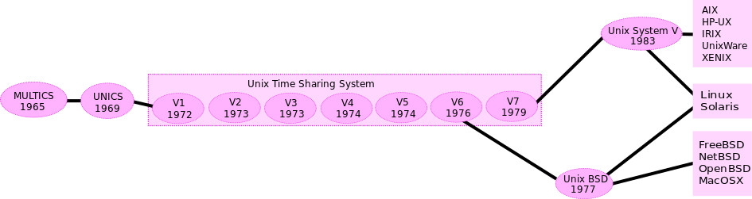

Dernier ajout : 

- [x] Promenades terrestres : *vi* ou *vim*, *bash* ou *dash* ?

# [kiweed](#)

**Let's break window and step to life, the universe and everything.**

>"Good progammer knows how things work. Great programmer knows why things works" (*Unknown* nevertheless *Well known*)

D'après Douglas Adams...

>There is a theory which states that if ever anyone discovers exactly what the
Universe is for and why it is here, it will instantly disappear and be replaced
by something even more bizarre and inexplicable.

>There is another theory which states that this has already happened.

(Douglas ADAMS, The HitchHiker's Guide to The Galaxy, Tome 2, The restaurant at the end of the Universe, p.3)

Pourquoi des références à Douglas ADAMS et son HHGTTG ?

Parce qu'en 1979, il parodie la réponse d'un supercalculateur à une question mal posée... À la question :

**What is the answer to life, the Universe and everything ?**

Après 7,5 millions d'années de *computation*... la réponse tombe...

**Forty-two**

(pages 114 à 120 du Tome 1 : The HHGTTG)

C'est le nom qu'ont choisi Xavier Niel et les anciens d'Épita pour leur [**école 42 : born to code**, à Paris](http://www.42.fr/)

;)

---

### <a name="sommaire">Sommaire</a>
##### [(très)Brève histoire d'unix et de linux](#u_histo)
##### [Promenades Terrestres](#terre)
##### [Balades Interstellaires](#interstellar)
##### [Guide du Codeur Galactique ](#intergal)

---

##### <a name="u_histo">(très)Brève histoire d'Unix/Linux</a>

###### L'intérêt de l'histoire (très très brève) ?

Comprendre que suivant les distributions les choses changent, et parfois
fondamentalement... 

Un exemple ? Le hashage md5 ne donne pas les mêmes 32 caractères sous
un MacOsX et sur une Ubuntu, en autres... Dommage, on ne peut donc pas comparer des empreintes...
Sans le savoir... ;D

###### Allons-y !

Nous sommes dans les 60's... À cette époque, et **c'est toujours vrai**, un processeur (donc simple cœur à l'époque) ne traite 
qu'une seule instruction à la fois ; un double coeur deux, etc. Mais ce sont des instructions **d'un même programme** ; ça
va *juste* plus vite.

La conséquence : tant que l'exécution d'un programme (plusieurs instructions, cqfd) n'était pas terminée, il était impossible de
*faire* autre chose... Par exemple, lancer une autre commande ou éditer un fichier...

En **1964** naît le projet **Multics** (*MULTiplexed Information and Computing Service*), initié par le MIT (Massachusetts Institute of Technology, Crambridge MA, banlieue de Boston), 
AT&T Bell Laboratories (AT&T, équivalent américain de France Télécom, Bell Laboratories, sa division recherche, déjà notamment 
célèbre par le nobel en 1954 de Bardeen, Brattain et Shockley pour l'invention du transistor), et General Electric.

Les concepts de Multics deviennent fondateurs des systèmes d'exploitation modernes :

- **Temps partagé** : on va pouvoir faire autre chose qu'attendre une fin d'exécution ;)

- **Multitâche préemptif** : le noyau alloue à chaque tâche un quantum de temps au delà duquel, finie ou pas finie, il la suspend
  pour passer à la suivante, etc. Jusqu'à revenir à cette tâche pour la poursuivre.

- **Système de fichier** hiérarchique : l'arborescence qu'on connaît

- **Multi-utilisateurs** : lié au multitâche, puisqu'un.e *user* est vu.e comme un processus, celui de son *interpréteur de commandes*.

En **1969** les Bell Labs se retirent mais les deux ingénieurs affectés à MULTICS, **Ken Thompson** et 
**Denis Ritchie**, lancent leur propre projet et le baptisent UNICS pour *UNiplexed Information and Computer Services*
(par jeu de mots : multics/unics) ; projet qui fut rebaptisé UNIX.

Une loi antitrust américaine interdisait alors à ATT de vendre autre chose que des équipements téléphoniques, les systèmes
informatiques étant l'apanage d'IBM.

En **1975**, il fut donc décidé de donner sous licence d'enseignement aux grandes universités... L'idée étant que des élèves
ayant fait leurs études informatiques sur ce système chercheraient à l'obtenir dans leurs entreprises...

**Mais c'est aussi en 1975** que les Bell Labs devinrent une entité distincte d'ATT... et purent continuer le développement d'Unix.

En **1977**, l'université de Berkeley en Californie propose sa première distribution Unix...

En **1979** Bell Labs publie à son tour sa première version d'Unix, Unix version 7, 
qui aboutira en 1983, à Unix System V (lire Unix Systen 5, du V en latin).

Dès lors, la guerre des Unix commence... L'illustration *wikipdédia* est parfaite pour déduire la suite :

Pour plus de détails, et une image beaucoup plus complète, lire l'article [*wikipedia* : Unix](https://fr.wikipedia.org/wiki/Unix)

[(**sommaire ^**)](#sommaire)

---

##### <a name="terre">Balades Terrestres</a>

Ce sera le dossier des choses techniques abordées simplement, sans dans trop de détails.

Sans autre précision, tout se passe sous Ubuntu.

[(**sommaire ^**)](#sommaire)

---

##### <a name="interstellar">Balades Interstellaires</a>

Une exploration de la galaxie Debian et ses multiples systèmes solaires : Ubuntu, Slackware, Debian, etc.

[(**sommaire ^**)](#sommaire)

---

##### <a name="intergal">Guide du Codeur Galactique</a>

Des galaxies Unix, RedHat, MacOsX, BSD, et toutes les autres... Même très éloignées :alien:

Pour coder, décoder, reverser, etc. :smile: :+1:

[(**sommaire ^**)](#sommaire)

---
