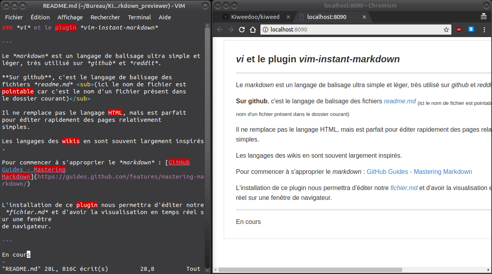

### *vi* et le plugin *vim-instant-markdown*

---

Le *markdown* est un langage de balisage ultra simple et léger, très utilisé sur *github* et *reddit*.

**Sur github**, c'est le langage de balisage des
fichiers *readme.md* (ici le nom de fichier est
pointable car c'est le nom d'un fichier présent dans
le dossier courant)

Il ne remplace pas le langage HTML, mais est parfait
pour éditer rapidement des pages relativement
simples.

Les langages des wikis en sont souvent largement inspirés.

Pour commencer à s'approprier le *markdown* : [GitHub
Guides - Mastering
Markdown](https://guides.github.com/features/mastering-markdown/)

L'installation de ce plugin nous permettra d'éditer notre et d'avoir la visualisation en temps réel sur un onglet:w
de navigateur :

---

En cours
